# BMO RAG

BMO RAG is a local-first retrieval-augmented generation system for BMO financial,
regulatory, investor-relations, and sustainability documents. It uses Docling for
extraction, BGE-M3 and Qdrant for hybrid retrieval, a BGE cross-encoder for reranking,
and the OpenAI Responses API for grounded, cited answers.

The system has four workflows:

1. **Ingestion** — convert PDFs and web pages into normalized, section-aware chunks.
2. **Indexing** — store dense BGE-M3 and Qdrant-native BM25 representations.
3. **Retrieval** — run hybrid search, rank fusion, reranking, and deduplication.
4. **Chat** — produce cited GPT-5 answers with context expansion and session memory.

## System architecture

```mermaid
flowchart LR
    subgraph Offline[Offline preparation]
        A[Local PDFs<br/>data/raw/*.pdf] --> C[Source discovery]
        B[Web URLs<br/>data/raw/urls.txt] --> C
        C --> D[Docling PDF/HTML extraction]
        D --> E[Section-aware normalization<br/>300-1500 characters]
        E --> F[Within-source exact deduplication]
        F --> G[Stable chunk IDs and metadata]
        G --> H[data/processed/docling/*.chunks.jsonl]
        H --> I[BGE-M3 document embeddings]
        H --> J[Qdrant BM25 sparse indexing]
        I --> K[(Qdrant hybrid collection)]
        J --> K
    end

    subgraph Online[Retrieval and answer generation]
        Q[User question] --> M[Conversation-aware query rewrite]
        M --> N[BGE-M3 query embedding]
        M --> O[BM25 keyword query]
        N --> P[Dense candidates]
        O --> R[Sparse candidates]
        K --> P
        K --> R
        P --> S[Reciprocal Rank Fusion]
        R --> S
        S --> T[BGE cross-encoder reranker]
        T --> U[Exact/contained-passage diversification]
        U --> V[Source and section expansion]
        V --> W[Context packing with citations]
        W --> X[GPT-5 via Responses API]
        X --> Y[Cited answer]
        Y --> Z[(Local SQLite observability)]
    end
```



Ingestion and indexing are persistent preparation stages. Rerun them when the corpus or
chunking settings change; retrieval and chat reuse the stored Qdrant collection.

## Technology stack

| Stage | Implementation |
| --- | --- |
| Extraction | Docling for PDFs; structured HTML/Markdown parsing for web pages |
| Chunking | Section-aware merge/split normalization with stable source-and-text IDs |
| Embeddings | `BAAI/bge-m3`, served locally through vLLM |
| Search store | Qdrant with 1,024-dimensional dense vectors and native BM25 sparse vectors |
| Fusion | Qdrant Reciprocal Rank Fusion (RRF) |
| Reranking | `BAAI/bge-reranker-v2-m3`, served locally through vLLM |
| Generation | OpenAI Responses API, `gpt-5` by default |
| Memory | Six recent turns plus compact structured state, in process only |
| Observability | Local SQLite traces with stages, retrieval, prompts, responses, and usage |

## Requirements

- Python 3.11 or newer.
- [uv](https://docs.astral.sh/uv/) or `pip`.
- Docker Desktop with Linux containers.
- An NVIDIA GPU available to Docker for automatic local vLLM startup (`--gpus all`).
- An OpenAI API key for chat only. Ingestion, indexing, and retrieval do not use OpenAI.
- Internet access for initial image/model downloads and remote URL ingestion.

With externally hosted Qdrant, embedding, and reranking services, pass their URLs and use
`--no-start-local`; the CLI then does not require a local NVIDIA GPU.

## Installation

Run commands from the repository root. These PowerShell examples use `.uvenv`:

```powershell
uv venv .uvenv --python 3.11
$env:UV_PROJECT_ENVIRONMENT = ".uvenv"
uv sync --extra dev
Copy-Item .env.example .env
```

Alternatively, activate any Python 3.11+ environment and run:

```powershell
python -m pip install -e ".[dev]"
```

Configure `.env`:

```dotenv
OPENAI_API_KEY=                 # Required only for chat
LLM_MODEL=gpt-5
EMBEDDING_MODEL=BAAI/bge-m3
QDRANT_URL=http://localhost:6333
QDRANT_API_KEY=
OBSERVABILITY_DB=data/observability/rag_observability.sqlite3
```

Do not commit `.env`. Verify the installation:

```powershell
.uvenv\Scripts\python.exe -m bmo_rag.cli health
```

## Corpus

The current processed corpus contains **26 sources and 6,171 chunks**. All 26 sources
succeeded in the latest ingestion manifest. Local filenames below are the actual inputs used
to build the index. A landing page is not marked as ingested when only a report downloaded
from that page is present.

### Requested source map

| Priority | Document | Canonical URL | Current corpus mapping | Status |
| --- | --- | --- | --- | --- |
| Core | BMO 2025 Annual Report | [PDF](https://www.bmo.com/ir/archive/en/bmo_ar2025.pdf) | `bmo_ar2025.pdf` → `bmo_ar2025` (1,435 chunks) | Included as local PDF |
| Core | BMO 2025 Annual Information Form | [PDF](https://www.bmo.com/ir/archive/en/bmo_AIF2025.pdf) | `bmo_AIF2025.pdf` → `bmo_AIF2025` (180 chunks) | Included as local PDF |
| Core | June 2026 Investor Presentation | [PDF](https://www.bmo.com/ir/files/Live%20Files/BMOInvestorPresentationEN.pdf) | `BMOInvestorPresentationEN.pdf` → `BMOInvestorPresentationEN` (212 chunks) | Included as local PDF |
| Core | Q2 2026 Corporate Fact Sheet | [PDF](https://www.bmo.com/ir/files/Live-Files/CorporateFactSheet.pdf) | `CorporateFactSheet.pdf` → `CorporateFactSheet` (7 chunks) | Included as local PDF |
| Core | 2026 quarterly financial information page | [Page](https://www.bmo.com/main/about-bmo/banking/investor-relations/financial-information) | URL with `#2026` → `financial-information-c5dc87e0c5` (15 chunks) | Included as web source |
| Core | Q2 2026 results release | [Release](https://newsroom.bmo.com/2026-05-27-BMO-Financial-Group-Reports-Second-Quarter-2026-Results) | Web → `...Results-ed105dc24d` (42); PDF → `Q226_EarningsRelease` (54) | Included in web and PDF renditions |
| Core / optional | BMO Investor Day 2026 | [Page](https://www.bmo.com/en-ca/main/about-bmo/banking/investor-relations/investor-day-2026/) | Page → `investor-day-2026-609c901e12` (3); transcript → `transcript_2026BMOInvestoDayTranscript` (381) | Included with transcript |
| Optional | Regulatory Disclosure | [Page](https://www.bmo.com/main/about-bmo/investor-relations/regulatory-disclosure) | Landing page absent; seven downloaded disclosure PDFs are indexed (1,127 chunks) | Underlying documents included |
| Optional | BMO 2025 Form 40-F, SEC EDGAR | [Filing](https://www.sec.gov/Archives/edgar/data/927971/000119312525307982/d938207d40f.htm) | URL → `d938207d40f-e11c68d11f` (3 chunks) | Included as web source |
| Optional | Sustainability Report / Public Accountability Statement | [Landing page](https://www.bmo.com/main/about-bmo/investor-relations/annual-reports-proxy-circulars) | `sustainability_and_climate_report_interactive.pdf` → `sustainability_and_climate_report_interactive` (645) | Report included; page absent |

The regulatory subtotal comprises `Bail_In_TLAC_Disclosure` (38),
`2026BFCBBNAStressTest` (31), `LCR_CY26Q1` (28), `LCR_CY26Q2` (27),
`NSFRCY26Q2` (20), `MainFeaturesTemplateQ326` (643), and `RegSuppQ326` (340).

### Additional indexed documents

| Document family | Current source IDs | Chunks |
| --- | --- | ---: |
| Q1 2026 earnings release and report to shareholders | `Q126_EarningsRelease`, `Q126_ReportToShareholders` | 486 |
| Q2 2026 report to shareholders | `Q226_ReportToShareholders` | 477 |
| Q3 2026 earnings release and report to shareholders | `Q326_EarningsRelease`, `Q326_ReportToShareholders` | 538 |
| Q1–Q3 2026 financial supplements | `Suppq126`, `Suppq226`, `SuppQ326` | 566 |

Local PDF inputs live in [`data/raw/`](data/raw/); web sources are declared in
[`data/raw/urls.txt`](data/raw/urls.txt). The latest run is recorded in
[`ingestion_manifest.json`](data/processed/docling/ingestion_manifest.json).

## 1. Ingestion

Place PDFs under `data/raw/`. Add remote HTML or PDF URLs to `data/raw/urls.txt`, one
per line. Blank lines and lines beginning with `#` are ignored.

```powershell
# Complete ingestion
.uvenv\Scripts\python.exe scripts\ingestion\ingest.py ingest

# One-source smoke test
.uvenv\Scripts\python.exe scripts\ingestion\ingest.py ingest --limit 1

# OCR for scanned PDFs
.uvenv\Scripts\python.exe scripts\ingestion\ingest.py ingest --do-ocr

# CPU extraction without table reconstruction
.uvenv\Scripts\python.exe scripts\ingestion\ingest.py ingest --device cpu --no-table-structure

# Explicit default chunk settings
.uvenv\Scripts\python.exe scripts\ingestion\ingest.py ingest --min-chunk-chars 300 --max-chunk-chars 1500 --chunk-overlap-chars 150
```

For each source, ingestion:

1. Discovers PDFs recursively and reads the URL registry.
2. Extracts text, tables, headings, and page provenance. Web ingestion attempts the source
   directly and has a reader fallback.
3. Merges small chunks, splits large chunks, and retains overlap on split passages.
4. Removes normalized exact duplicates **within the same source**.
5. Assigns a stable ID from the source ID and normalized text.
6. Writes the extraction, metadata, chunks, and run manifest.

```text
data/processed/docling/
├── <source>.docling.json    full structured extraction
├── <source>.metadata.json   source, options, timing, confidence, and dedup summary
├── <source>.chunks.jsonl    normalized chunks consumed by indexing
└── ingestion_manifest.json  complete run success/failure summary
```

Inspect the manifest before indexing. A failed source should not be silently accepted into a
production corpus.

## 2. Hybrid indexing

Build the BGE-M3 dense + BM25 collection:

```powershell
.uvenv\Scripts\python.exe scripts\indexing\build_hybrid_index.py
```

The script starts or reuses Qdrant and the embedding service, loads every chunk JSONL,
embeds `heading path + chunk body`, and stores both representations with citation metadata.
Qdrant persists in the `bmo-rag-qdrant-storage` volume. Open its
[dashboard](http://localhost:6333/dashboard) after startup.

Use a full rebuild whenever chunks were deleted, changed, or regenerated:

```powershell
.uvenv\Scripts\python.exe scripts\indexing\build_hybrid_index.py --reindex
```

Without `--reindex`, indexing resumes missing IDs. That is suitable for an interrupted build
or strictly additive corpus change, but it does not delete obsolete points. The script verifies
that the final Qdrant count equals the processed corpus count.

```powershell
# Use services started elsewhere
.uvenv\Scripts\python.exe scripts\indexing\build_hybrid_index.py --no-start-local --base-url http://127.0.0.1:8000/v1 --qdrant-url http://127.0.0.1:6333
```

> **Important:** use `scripts/indexing/build_hybrid_index.py`. The current
> `bmo-rag index` command is reserved but remains a placeholder.

## 3. Retrieval

```powershell
.uvenv\Scripts\python.exe scripts\querying\test_retrieval.py "What was BMO's CET1 ratio?"
```

Omit the question for an interactive prompt or use `-k 10` for ten results.

```text
question
  → BGE-M3 dense search + Qdrant BM25 search
  → reciprocal-rank fusion over 30 candidates
  → BGE cross-encoder reranking
  → exact and contained-passage duplicate removal
  → top-k cited chunks
```

```powershell
# Hybrid without reranking
.uvenv\Scripts\python.exe scripts\querying\test_retrieval.py "your question" --no-rerank

# Dense only
.uvenv\Scripts\python.exe scripts\querying\test_retrieval.py "your question" --dense

# Reuse separately started services
.uvenv\Scripts\python.exe scripts\querying\test_retrieval.py "your question" --no-start-local
```

After reranking, lower-ranked exact copies and passages contained in a higher-ranked result
are collapsed. If a query names a document, source-aware retrieval adds filtered lanes and
protects requested-source evidence from being crowded out. Duplicate provenance remains in
result metadata. See [`docs/querying-workflow.md`](docs/querying-workflow.md).

## 4. Grounded chat

Chat requires `OPENAI_API_KEY` in `.env` or the environment.

```powershell
# Start an empty memory-enabled session
.uvenv\Scripts\python.exe scripts\querying\chat.py

# Start with a question
.uvenv\Scripts\python.exe scripts\querying\chat.py "Compare BMO's Q1 and Q2 2026 CET1 ratios."

# Buffered output and a larger answer budget
.uvenv\Scripts\python.exe scripts\querying\chat.py --no-stream --max-answer-tokens 8000 "Compare ..."
```

The launcher stays open for follow-ups. Type `exit` or `quit` to stop. For each turn:

1. Follow-ups are rewritten as standalone retrieval queries from recent conversation state.
2. Thirty hybrid candidates are reranked to eight seed chunks.
3. Duplicates are diversified and explicitly named sources are honored.
4. Same-source neighbors and sections are selectively expanded, up to 14 chunks.
5. At most 32,000 context characters are packed with source, page, and heading metadata.
6. GPT-5 is instructed to use only the evidence and cite labels such as `[S1]`.
7. The last six turns exist only for the life of the process.

Responses API storage is disabled with `store: false`. Local observability is enabled by
default and may contain full questions, evidence, prompts, and answers. Treat
`data/observability/` as sensitive. Disable it with `--no-observe` or read
[`docs/observability.md`](docs/observability.md).

```powershell
$env:PYTHONPATH = "src"
.uvenv\Scripts\python.exe -m bmo_rag.cli monitor --limit 20
```

## Evaluation and tests

The retrieval benchmark contains 200 questions. Each required fact is grouped with its
accepted equivalent chunks, so recall measures evidence coverage rather than exact chunk-ID
coincidence. Strict exact-ID recall and repeated-evidence redundancy remain available for
diagnosis. Corpus and dataset fingerprints reject stale comparisons.

```powershell
.uvenv\Scripts\python.exe scripts\evaluation\benchmark_hybrid_retrieval.py
```

Results go to `outputs/benchmarks/hybrid_retrieval_comparison/`. See
[`data/golden/README.md`](data/golden/README.md) and
[`outputs/README.md`](outputs/README.md).

```powershell
$env:PYTHONPATH = "src"
.uvenv\Scripts\python.exe -m pytest
.uvenv\Scripts\python.exe -m ruff check src tests scripts
.uvenv\Scripts\python.exe -m mypy src
```

## Repository layout

```text
config/                     configuration examples
data/raw/                   source PDFs and URL registry
data/processed/docling/     structured extraction, metadata, and chunk JSONL
data/golden/                curated evaluation data and manifests
data/observability/         local SQLite traces
docs/                       architecture and operating notes
outputs/                    generated benchmark and audit reports
scripts/ingestion/          ingestion launcher
scripts/indexing/           hybrid index builder
scripts/querying/           retrieval, corpus search, and chat launchers
scripts/evaluation/         gold builders and retrieval benchmarks
src/bmo_rag/                application package
tests/                      unit and integration tests
```

## Operational notes

- Rerun ingestion and use `--reindex` after changing files or chunking parameters.
- First model startup can take several minutes; Docker and model caches persist in volumes.
- Qdrant, embeddings, and reranking bind to localhost on ports `6333`, `8000`, and `8001`.
- Inspect startup failures with `docker logs bmo-rag-vllm` or
  `docker logs bmo-rag-reranker`.
- Dense, fusion, and reranker scores are rankings, not calibrated probabilities.
- Generated results belong under `outputs/`; curated fixtures belong under `data/golden/`.
